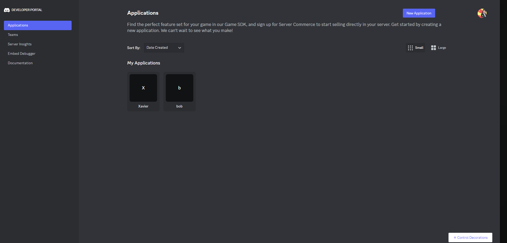
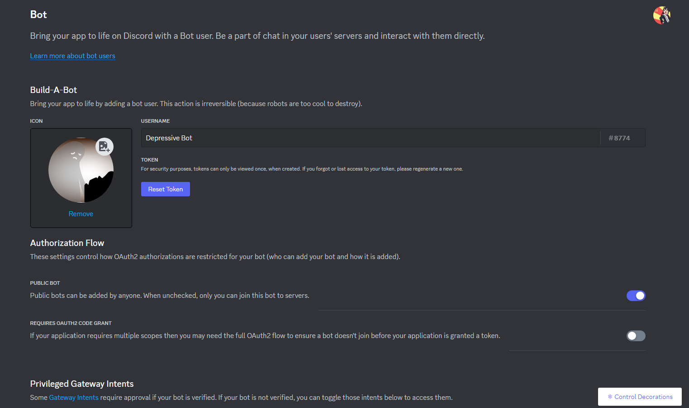
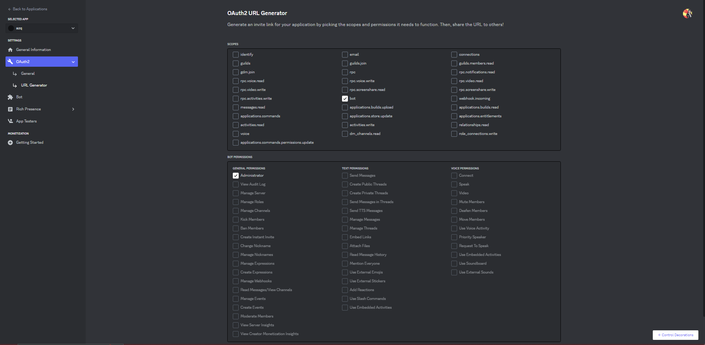

# SECRET SANTA

Un matin glacial à Rambouillet, Xavier, notre héros sans préparatifs pour les fêtes, se promène en frissonnant. En passant devant un centre commercial, il croise un sapin de Noël majestueux. Il se regarde et pense : "Noël approche, et moi, je suis encore là sans plan... Pourtant, je suis le mec cool du groupe, non ?" Après une journée entière de réflexion, Xavier, le maître des énigmes et des jeux de piste, croise un pote qui s'éclate avec un bot Discord. Il s'exclame : "Eurêka ! Je vais créer un bot Discord pour orchestrer un Secret Santa, tiens !"

## Xavier, curieux personnage

Xavier est un homme honnête, bien aimé de ses proches et plein de bons sentiments.  \
Il consacre son temps libre à créer des énigmes et des jeux de piste, c'est sa passion.

## Mais c'est quoi un Secret Santa ?

En faisant des recherches sur internet, Xavier a découvert que le Secret Santa est une tradition de Noël qui consiste à offrir un cadeau à une personne tirée au sort.

Il imagine son bot choisissant aléatoirement les participants, envoyant des messages privés à chacun pour révéler le destinataire de son cadeau, et tout ça avec un budget maximum, histoire que personne ne se retrouve avec un yacht en cadeau. Voilà le plan farfelu de Xavier pour des fêtes hilarantes !

# A toi de jouer

Aide Xavier à créer son bot Discord Secret Santa. \
Il a déjà commencé à regarder comment créer un bot Discord, mais il a besoin de toi pour le reste, comme si tu étais le lutin le plus geek du Père Noël.

# Qu'est-ce que Discord ?

Discord est un service de communication vocale et textuelle gratuit disponible sur plusieurs plateformes. Ce chat est principalement utilisé pour parler de jeux vidéo, répondre à des questions ou discuter pendant qu'on joue. Pour accéder à Discord, rendez-vous sur le site officiel de [Discord](https://discord.com/). Vous pourrez vous inscrire et utiliser l'interface web ou télécharger le client. Ensuite, vous pourrez créer un serveur personnel ou rejoindre un serveur en tant qu'administrateur.

# Comment créer notre Père Noël bot ?

1. Tout d'abord, rendez-vous sur le [site des développeurs Discord](https://discord.com/developers/applications).
2. Connectez-vous et créez une nouvelle application en cliquant sur le bouton en haut à gauche de l'onglet "Applications".
   
3. Choisissez un nom pour l'application (ce n'est pas le nom du bot).
4. Accédez aux options de l'application en cliquant dessus, puis sélectionnez l'onglet "Bot" sur la gauche.
5. Changez l'icône et le nom du bot selon vos préférences.
   
6. Félicitations, vous avez créé votre premier bot 🤖 !

# Comment inviter notre robot de Noël à la fête ?

1. Pour utiliser votre bot, vous devez l'ajouter à un serveur en utilisant un lien d'invitation.
2. Dans l'onglet "OAuth2", cliquez sur "URL Generator".
3. Choisissez les permissions nécessaires pour votre bot, par exemple, "Administrator".
4. Un lien d'invitation apparaîtra en bas du tableau. Utilisez ce lien pour inviter votre bot sur un serveur où vous êtes administrateur.
   

# Mais il est hors ligne ?

Si votre bot apparaît hors ligne, la magie du code commence. Pour commencer à coder, vous avez besoin de vous connecter à votre robot en utilisant un token.
1. Dans l'onglet "Bot", cliquez sur "Reset Token" pour générer un token unique.
   
2. Le token est la carte d'identité de votre robot. Ne le partagez avec personne, car toute personne ayant accès au token peut utiliser votre bot.
3. Ce token sera à mettre dans le code pour ce connecter à votre robot

Maintenant, à vous de coder la suite... 🚀
