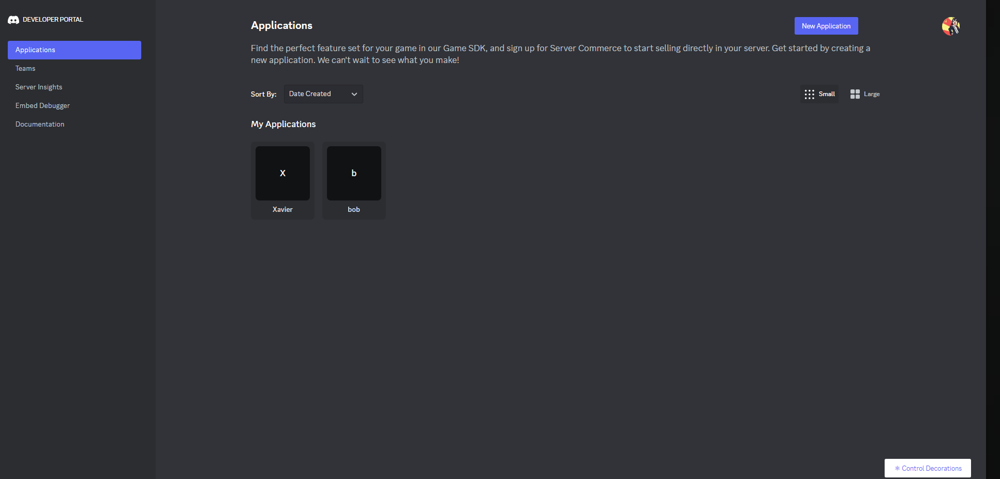
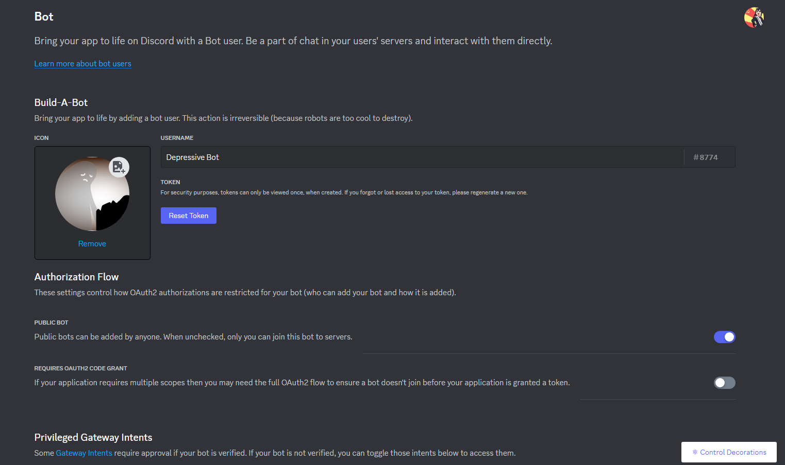
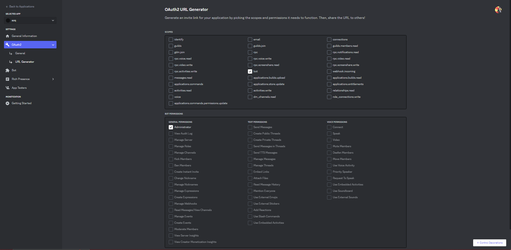

# Qu'est-ce que Discord ?

Discord est un service de communication vocale et textuelle gratuit disponible sur plusieurs plateformes. Ce chat est principalement utilisé pour parler de jeux vidéo, répondre à des questions ou discuter pendant qu'on joue. Pour accéder à Discord, rendez-vous sur le site officiel de [Discord](https://discord.com/). Vous pourrez vous inscrire et utiliser l'interface web ou télécharger le client. Ensuite, vous pourrez créer un serveur personnel ou rejoindre un serveur en tant qu'administrateur.

# Comment créer notre Père Noël bot ?

1. Tout d'abord, rendez-vous sur le [site des développeurs Discord](https://discord.com/developers/applications).
2. Connectez-vous et créez une nouvelle application en cliquant sur le bouton en haut à gauche de l'onglet "Applications".
   
3. Choisissez un nom pour l'application (ce n'est pas le nom du bot).
4. Accédez aux options de l'application en cliquant dessus, puis sélectionnez l'onglet "Bot" sur la gauche.
5. Changez l'icône et le nom du bot selon vos préférences.
   
6. Félicitations, vous avez créé votre premier bot 🤖 !

# Comment inviter notre robot de Noël à la fête ?

1. Pour utiliser votre bot, vous devez l'ajouter à un serveur en utilisant un lien d'invitation.
2. Dans l'onglet "OAuth2", cliquez sur "URL Generator".
3. Choisissez les permissions nécessaires pour votre bot, par exemple, "Administrator".
4. Un lien d'invitation apparaîtra en bas du tableau. Utilisez ce lien pour inviter votre bot sur un serveur où vous êtes administrateur.
   

# Mais il est hors ligne ?

Si votre bot apparaît hors ligne, la magie du code commence. Pour commencer à coder, vous avez besoin de vous connecter à votre robot en utilisant un token.
1. Dans l'onglet "Bot", cliquez sur "Reset Token" pour générer un token unique.
   
2. Le token est la carte d'identité de votre robot. Ne le partagez avec personne, car toute personne ayant accès au token peut utiliser votre bot.

Maintenant, à vous de coder la suite... 🚀
